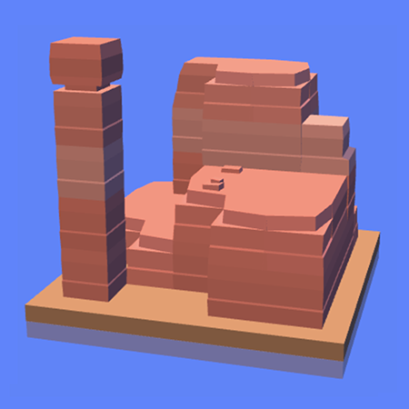

mapgen
------------
"mapgen" is a tool for quickly creating and editing rocky terrain structures in browser.
I used three.js to handle 3D geometry and other useful WebGL functionality.

The online version can be found [here](https://ebogo1.github.io/mapgen/).
Click to add a block, shift + click to remove one, click and drag to control the camera.

------------
Inspired by Oskar Stålberg's [Brick Block](http://oskarstalberg.com/game/house/index.html)
and Overwatch (Route 66).
